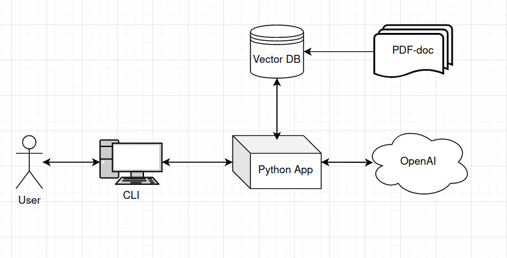

# Project Name


## Table of Contents

- [Project Name](#project-name)
  - [Table of Contents](#table-of-contents)
  - [Introduction](#introduction)
  - [Architecture](#architecture)
  - [Installation](#installation)
    - [Prerequisites](#prerequisites)
    - [Steps](#steps)
  - [Configuration](#configuration)
  - [License](#license)
  - [Contact](#contact)

## Introduction

The repository provides an implementation of RAG using two frameworks: Langchain and LlamaIndex. A PDF file is used as the source. The vectors are stored in the Qdrant cloud cluster.

## Architecture



## Installation

### Prerequisites

Python 3.9.17 was used during development, but the code should work with later versions as well.

- Python 3.9+
- pip
- uv

### Steps

1. Clone the repository:

  ```bash
  git clone https://gitlab.raftds.com/sophia.philippova/rag-openai-chatbot.git
  cd gitlab-project-template
  ```


2. Install the required packages:

  ```bash
  uv venv
  source .venv/bin/activate
  uv pip install -r requirements.txt
  ```

3. Run the Langchain app:

    ```
    cd langchain-app
    uv run main.py
    ```

4. Run the LlamaIndex app:
    
    ```
    cd llamaindex-app
    uv run main.py
    ```


## Configuration

Configure .env file like this:

```bash
    OPENAI_API_KEY=
    OPENAI_MODEL=

    QDRANT_HOST=
    QDRANT_KEY=
    COLLECTION_NAME=

    PDF_PATH=

    VECTOR_SIZE=
    OPENAI_MODEL=
```

## License

This project is licensed under the MIT License - see the [LICENSE](LICENSE) file for details.

## Contact

Author Name - [@sonymanetov](https://github.com/sonymanetov)

Project Link: [https://github.com/sonymanetov/openai-agent-rag](https://github.com/sonymanetov/openai-agent-rag)
